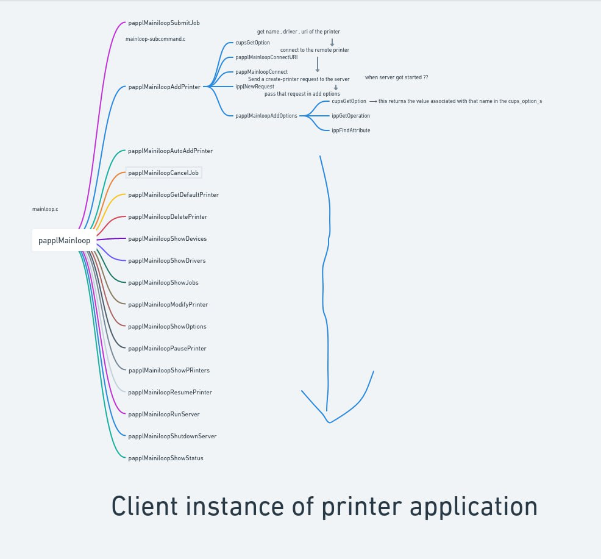
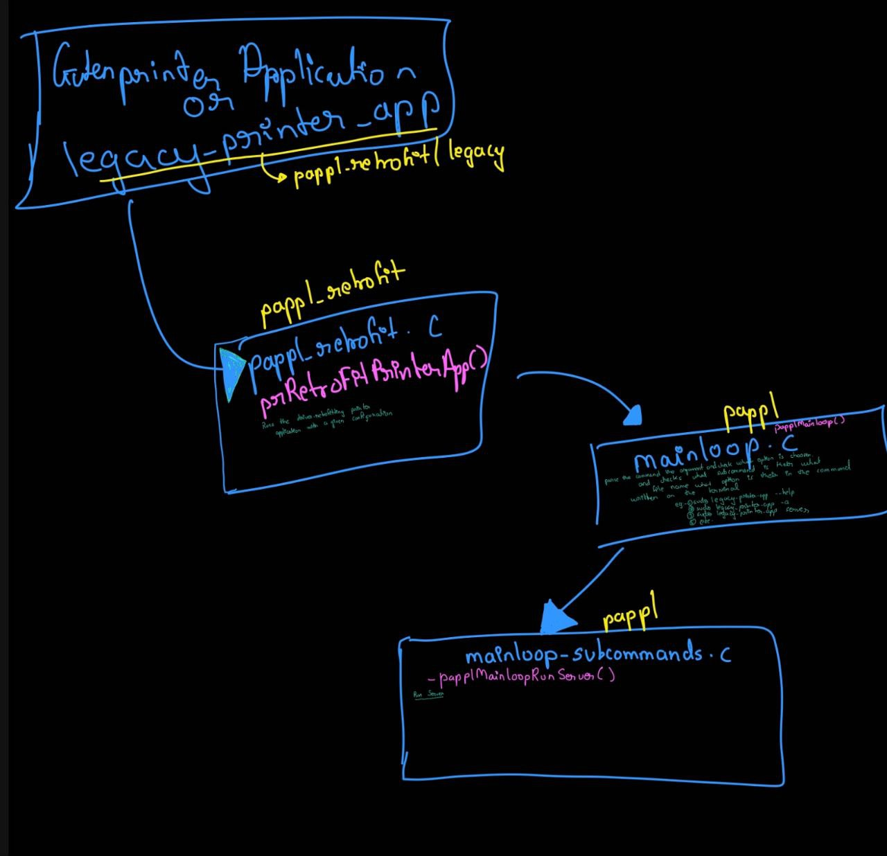
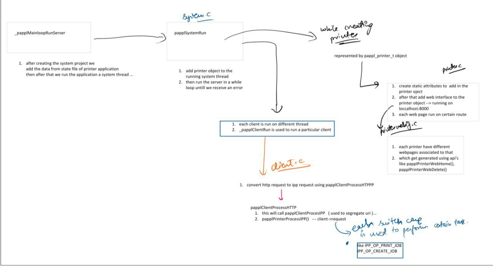

# About the Project:
The primary goal of this project is to transition from the classic CUPS driver system, which relies on the now-obsolete PPD (PostScript Printer Description) files, to a more modern and efficient approach using PAPPL (Printer Application Framework). This transition will involve creating a new Printer Application using the libgutenprint library and PAPPL, enabling users to easily manage their printers and print jobs. The project aims to expose all the printer-specific options and parameters of the Gutenprint driver through a web admin interface, ensuring a user-friendly experience. Finally, the Printer Application will be packaged as a Snap, making it easy to distribute and install on various Linux distributions.
In summary, this project is about modernizing the printing infrastructure for Gutenprint, allowing it to seamlessly integrate with PAPPL, improving user accessibility, and ensuring compatibility with the latest printing standards while eliminating the need for PPD files.

# My Task:
1. In this project, my primary task is to develop a PAPPL-based Printer Application for Gutenprint. This entails creating a software component that interfaces with the libgutenprint library to facilitate the management of printers and print jobs. This Printer Application will act as a bridge between the user and the Gutenprint driver, making it easier for users to configure, control, and utilize their printers, especially on Linux and other open-source operating systems.

2. One of the essential aspects of the task is ensuring that all the printer-specific options and parameters available in the Gutenprint driver are seamlessly accessible through a web-based administrative interface. Users should be able to configure various printing settings with ease, providing a user-friendly experience. This involves understanding the intricacies of the Gutenprint driver and creating a user interface that abstracts the technical complexities, making it intuitive for individuals to set up their printers according to their preferences.

3. Furthermore, my role encompasses streamlining the printing workflow by eliminating the dependency on PPD files (PostScript Printer Description). The move away from PPD files toward a more modern and efficient approach helps improve the performance and maintainability of Gutenprint, aligning it with the latest standards in the Linux and open-source printing ecosystem.

4. Finally, packaging the developed Printer Application as a Snap, a universal Linux package format. This packaging simplifies the distribution and installation of the Gutenprint Printer Application across various Linux distributions, ensuring broader accessibility for users. The Snap format enhances the portability and ease of deployment of the application, ultimately benefiting the open-source community and Linux users who rely on Gutenprint for their printing needs.

#Synopsis
1. Pappl Mainloop Flow for different operation

3. Flow of gutenprinter-app ( current one retrofitted version ) 

5. First of all server get started using the command 
For the demonstration purpose let’s use legacy-printer-app
Sudo legacy-printer-app server
Flow of running the pappl server

7. Pappl-retrofit and pappl architecture link
https://miro.com/app/board/uXjVNSQnNPI=/?share_link_id=311962033449

# Repository Link

https://github.com/RudraGayu/Native-Gutenprinter-app

